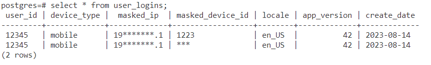

# Fetch Rewards
## Data Engineering Take Home: ETL off a SQS Queue

### Instruction:
(Lets assume that you have installed a Vscode, Docker, PostgreSQL, AWS, SQLTools, Python)

1. Navigate to window, look for 'cmd' then run.

2. In the promt in the 'cmd' type below entire row. (make sure to include the '.')
        code .
    Then hit enter.

3. Initialize docker
    - Open a new terminal
    - Type below command then hit enter:
        docker-compose up

4. Initialize AWS
    - Open a new terminal
    - Type below command then hit enter:
        aws --endpoint-url=http://localhost:4566 sqs list-queues --region us-west-2

5. Initialize Postgre
    - Open a new terminal
    - Type below command then hit enter:
        docker exec -it (Container ID) psql -U postgres
    - for container ID, type below code to see the ID
        docker ps

6. prepare the SQS queue (send AWS server a query):
    -Open a new terminal
    - Type below command then hit enter:
        aws --endpoint-url=http://localhost:4566 sqs create-queue --queue-name login-queue --region us-west-2
        MESSAGE='{"user_id": "12345", "device_type": "mobile", "ip": "192.168.1.1", "device_id": "123", "locale": "en_US", "app_version": 42, "create_date": "2023-08-14"}'
        aws --endpoint-url=http://localhost:4566 sqs send-message --queue-url http://localhost:4566/000000000000/login-queue --message-body "$MESSAGE"

7. Run a python file (that has algorithm in it):
    -Open a new terminal
    -Type below command then hit enter:
        python readSQS.py
    - If you didn't install a necessary library, please install as below (then run above command again)
        pip install boto3
        pip install psycopg2-binary

8. run SQL queries:
    - Go back to terminal we generated at step 5 (Postgre).
    - Type below command then hit enter:
        select * from user_logins;

Then the output should be something as below.

-------------------- This is the end of the file --------------------
